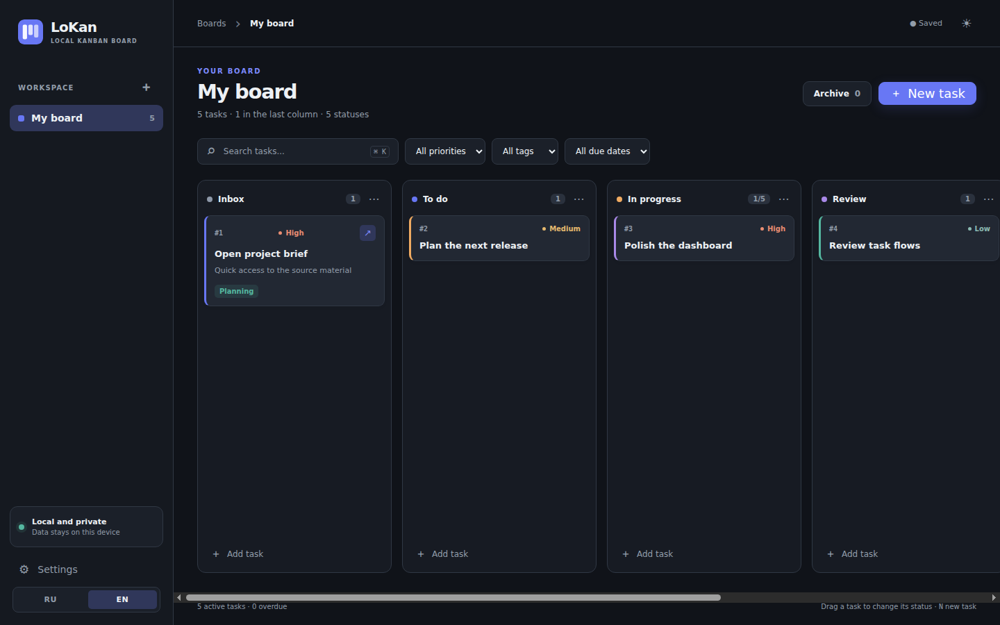

# LoKan — Local kanban board

Локальная канбан-доска для Windows на Electron. Работает без аккаунта, облака и сервера. Интерфейс доступен на русском и английском языках.

**[Скачать установщик Windows](https://github.com/nesfe/LoKan/releases/latest)**



## Возможности

- Несколько независимых досок, настраиваемые статусы и лимиты задач.
- Последовательные номера `#1`, `#2`, … внутри каждой доски. Удалённые номера не переиспользуются.
- Перетаскивание карточек между колонками и внутри колонки.
- Приоритеты, сроки, цветные карточки и теги, описания и чек-листы.
- Поле **«Ссылка»** в задаче. Название и значок ↗ на карточке открывают веб-ссылку в браузере; нажатие на остальную часть карточки открывает редактор. Поддерживаются `http://` и `https://`; для адреса без протокола добавляется `https://`.
- Поиск по номеру, названию, описанию, ссылке и тегам; фильтры по приоритету, тегу и сроку.
- Архив с восстановлением, светлая и тёмная темы, переключатель RU/EN под настройками.
- Автоматическое локальное сохранение, резервная копия, экспорт и импорт JSON.
- Горячие клавиши: `N` — новая задача, `Ctrl/Cmd+K` — поиск, `Esc` — закрыть окно.

## Запуск из исходников

Требуются Node.js 20+ и npm.

```bash
npm ci
npm start
```

Для проверки модели данных: `npm test`. Для сборки установщика: `npm run dist:win` на Windows, `npm run dist:linux` на Linux или `npm run dist:mac` на macOS. Готовые файлы появятся в `dist/`. Windows-установщик также собирается в GitHub Actions. Подпись кода не настроена, поэтому Windows может показать предупреждение SmartScreen.

## Хранение данных

Файл `lokan.json` лежит в локальном каталоге данных приложения Electron (`userData`), а предыдущая версия — в `lokan.backup.json`. Точный путь показан в настройках. Запись выполняется через временный файл и переименование. Отдельная БД не нужна: весь набор досок хранится в одном файле, который можно экспортировать.

Импорт **заменяет** текущие доски. Перед импортом можно сделать экспорт. Данные задач не отправляются по сети; открытие ссылки передаёт её браузеру по нажатию пользователя.

## English

LoKan is an offline desktop kanban board for Windows. It includes multiple boards, customizable statuses and WIP limits, numbered tasks, drag and drop, priorities, due dates, colors, tags, descriptions, checklists, search, filters, archive, and JSON backup. Add a web link to a task and open it directly from the card title or ↗ icon. Switch between English and Russian at the bottom of the sidebar. All task data stays on your device.

## Лицензия

MIT.
